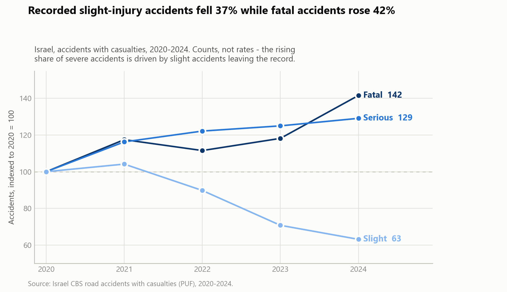
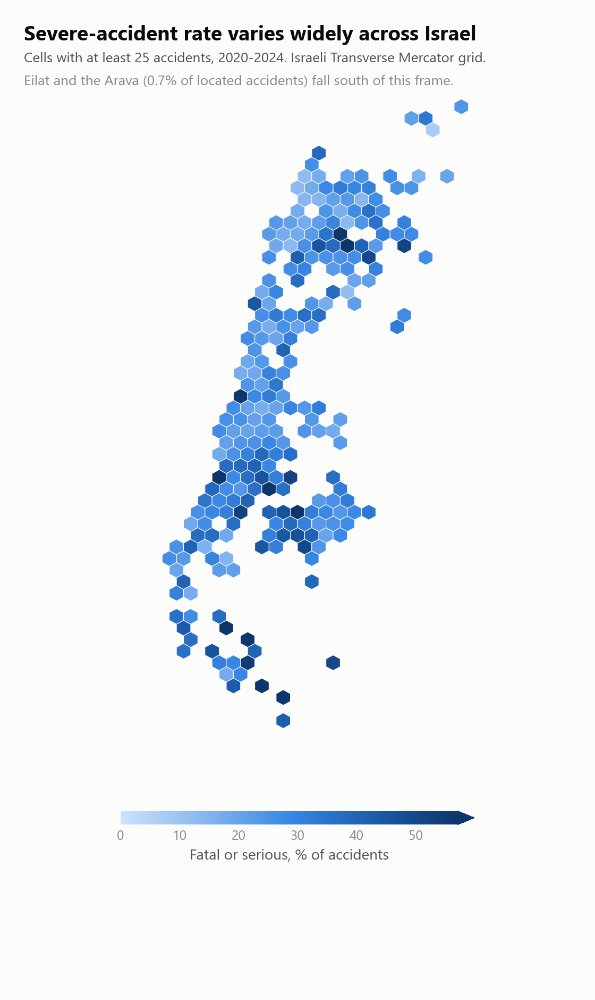

# Predicting Road Accident Severity in Israel

Can the severity of a road accident — **fatal, serious, or slight** — be predicted
from the circumstances recorded at the scene? This project works through that
question on five years of Israeli Central Bureau of Statistics data, from raw
government CSVs to a modelling plan.

**Status:** exploratory analysis complete · feature engineering in progress ·
modelling not yet started. No performance numbers are claimed yet.

---

## The headline finding

The obvious read of this dataset is that Israeli roads got sharply more dangerous
between 2020 and 2024: the share of accidents that were fatal or serious climbed
from 20% to 34%. Looking at counts rather than shares tells a different story.

<picture>
  <source media="(prefers-color-scheme: dark)" srcset="docs/images/severity-trend-dark.png">
  
</picture>

| Year | Fatal | Serious | Slight | Total |
|---|---:|---:|---:|---:|
| 2020 | 286 | 1,899 | 8,651 | 10,836 |
| 2021 | 336 | 2,208 | 9,010 | 11,554 |
| 2022 | 319 | 2,320 | 7,765 | 10,404 |
| 2023 | 338 | 2,374 | 6,120 | 8,832 |
| 2024 | 405 | 2,452 | **5,458** | 8,315 |

Fatal accidents rose 42% and serious 29% — but **recorded slight-injury accidents
fell 37%**, from 8,651 to 5,458. Most of the apparent rise in severity is the
slight class leaving the record, not the severe classes growing.

Israel's population and vehicle-kilometres both grew over this period, so a 37%
decline in minor-injury accidents is more consistent with a change in reporting or
recording practice than with a real safety collapse. This is a hypothesis, not a
proven cause — it needs checking against CBS methodology notes.

Either way it drives the modelling design: **the class prior is shifting for
reasons unrelated to the features**, so no model learns its way out of it from
road geometry and collision type. That calls for explicit prior correction or
recalibration against the target year, not just treating 2024 as a harder test set.

---

## Where accidents are severe

Severity is strongly geographic. Non-urban roads, and the periphery generally,
carry far higher severe-accident rates than the dense centre.

<picture>
  <source media="(prefers-color-scheme: dark)" srcset="docs/images/severity-map-dark.png">
  
</picture>

The EDA treats this carefully: sparse cells produce meaningless 0%/100% rates, so
geographic signal is only accepted where cells carry enough accidents *and* hold
the same side of the yearly baseline across multiple years.

---

## The data

[Road traffic accidents with casualties, 2020–2024][dataset], published by the
Israeli Central Bureau of Statistics as a Public Use File.

- **49,941 accidents**, 45 recorded fields
- Police-recorded accidents **involving casualties only** — so the target is
  severity *conditional on an injury having occurred*, not accident risk
- Fields cover road type and geometry, location, time, weather, lighting, road
  surface, collision type and pedestrian circumstances
- All values are Hebrew-language numeric codes; the project carries its own
  English codebook mapping every field

The accompanying casualties and vehicles files are deliberately **not** used.
Casualty counts determine the severity label, so joining them would be direct
target leakage.

## Target

`HUMRAT_TEUNA`, three ordered classes, heavily imbalanced (2020–2023):

| Class | Share |
|---|---:|
| Slight | 75.8% |
| Serious | 21.1% |
| Fatal | 3.1% |

Always predicting the majority class gives **75.8% accuracy but only 0.287 macro
F1** on 2020–2023 — which is why macro F1 is the primary metric and accuracy is
not used alone.

## Approach

- **Temporal split, not random.** Train on 2020–2023, hold out 2024. A random
  split would leak the future into the past and, given the drift above, badly
  overstate performance.
- **Temporal cross-validation** for model selection: train 2020 → validate 2021,
  train 2020–21 → validate 2022, train 2020–22 → validate 2023.
- **Macro F1** as the primary metric, with per-class precision/recall and fatal
  recall tracked separately.
- **Leakage review** before feature selection: identifiers, geocoding-process
  fields, and source-file metadata are excluded; the accident year is used for
  splitting only.
- **Structural missingness is preserved.** Many fields apply only to certain road
  or accident types, so *missing*, *unknown*, and *not applicable* are three
  different states and are not collapsed into one.

`02_feature_analysis.ipynb` reviews all 45 fields individually against the
target and produces an explicit keep / drop / replace decision for each, plus
18 candidate derived features. It is written to narrow the modelling search
space, not to fix the feature set in advance.

---

## Repository

```
data/raw/                      CBS source files (downloaded, not committed)
docs/images/                   README figures
notebooks/
  01_data_understanding.ipynb  data loading, temporal split, data dictionary
  02_feature_analysis.ipynb    per-feature EDA and feature decisions
  03_feature_engineering.ipynb transformations and validation
scripts/
  download_data.py             fetch the source data
  make_readme_figures.py       regenerate the figures above
src/
  codebook.py                  coded-value → label mappings
  data.py                      load the development / final-test split
  features.py                  derived-feature transformations
```

## Getting started

```bash
py -m pip install -r requirements.txt
py scripts/download_data.py
```

Then open [`notebooks/01_data_understanding.ipynb`](notebooks/01_data_understanding.ipynb)
and work through the notebooks in order. The download script resolves its URLs
from the data portal's API at runtime, so it keeps working when the portal
reassigns resource identifiers.

## Next steps

- Finish `03_feature_engineering.ipynb`: it currently imports a
  `road_accident_ml` package that doesn't exist and needs to be wired up to
  the `src/` modules instead, then validated against the temporal split
- Baseline models with temporal cross-validation, macro F1 reported per fold
- Comparison of geographic representations (district, subdistrict, road segment,
  coordinate grid) for incremental value
- Calibration against the shifting class prior

[dataset]: https://data.gov.il/dataset/2023-puf
